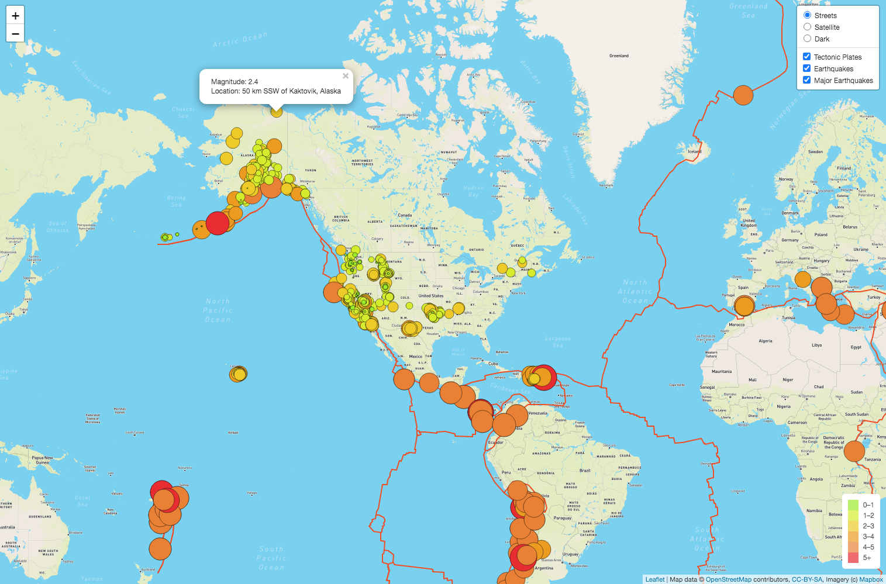

# **Mapping_Earthquakes**  

## **Overview of Project**
In this project we are creating a web page to retrieve the data regarding the earthquakes during the past 7 days and show them on a map.

### **Project Summary**

Using HTML, JavaScript, Leaflet and Mapbox, a webpage has been created to show the earthquakes occurred in the past 7 days on a map. In this map we have a collection of three maps (as base layers) from which the user can choose a map to present the data. the desired map can be chosen using a controller panel at the top right corner of the page. the options for the maps are those with the radio buttons. Then we added three layers to the map by calling the GeoJSON files containing the data we  need for each layer. The first layer shows the boundaries of the tectonic plates of the Earth. The second one illustrates all of the earthquakes happened in the past seven days and the last layer contains the data regarding the earthquakes with the magnitude grater than 4.5. These layers can be shown on the map individually or together, to do so user can toggle them on and off by checking or unchecking their checkboxes inside the controller panel.
&nbsp;

each circle on the map indicates the location of an earthquake. The color and radius of the circles depend on the magnitude of the earthquake. By clicking on the circles a popup will show the location and magnitude of the earthquake. a view of the webpage is shown in the figure below.
&nbsp;

